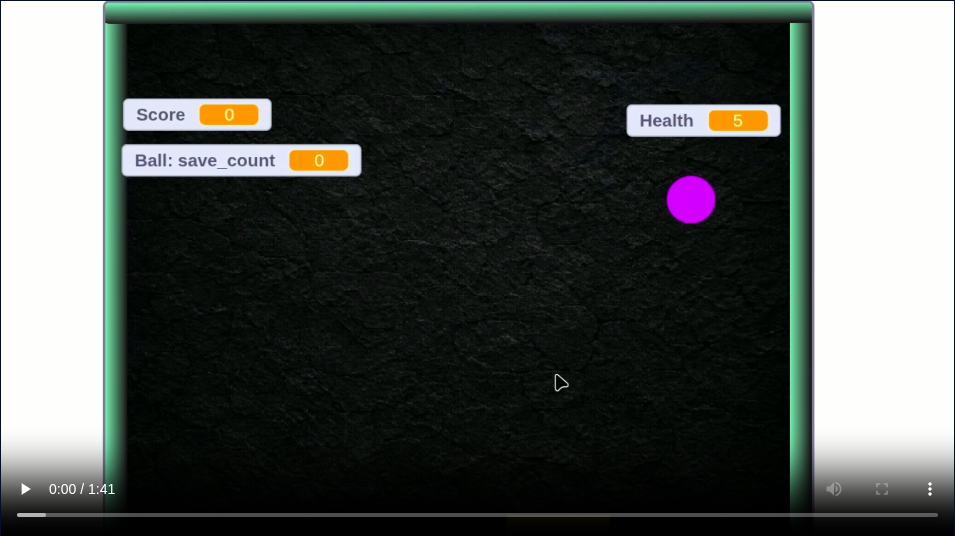

# My BreakOut

`My BreakOut` is a simple arcade-style game in which a ball moves around the canvas and bounces off its edges. The player's objective is to keep the ball from touching the bottom edge by using a movable plank.

The plank follows the player's mouse movement, allowing the player to position it under the ball and save it from falling.

## Objective

The goal is to **score as much as possible while keeping the ball from touching the ground (bottom edge of the canvas).**

## Game screen cast

## How to Start the Game

Press the **Space** key to start the game.

## Ball Speed

- **Default speed:** `5`
- The ball's speed increases by `0.5` units until it reaches `7`.
- After reaching `7`, the speed increases by `0.2` units.

## Sprites

### 1. Plank

- The horizontal position of the plank is controlled by the mouse's X-coordinate.
- The plank's Y-coordinate is fixed at `-200`.
- The X-coordinate ranges from `-192` to `189`.

### 2. Ball

The ball has two main scripts:

1. **Movement and collision control**
   - Controls the ball's movement.
   - Detects collisions with the walls and plank.
   - Controls the ball's direction after collisions.

2. **Score and health tracking**
   - Tracks the player's score.
   - Tracks the player's health.

### 3. Edge Pipes

The game contains three edge elements:

- Left edge
- Right edge
- Top edge

These edges define the boundaries from which the ball can bounce.

## Score and Health System

The player's score and health are updated based on how many times the ball is successfully saved.

1. After every **5 saves**, the player receives **1 score**.
2. After every **4 scores**, the player receives **1 Health Point**.
3. The game ends when the player's **Health reaches 0**.

## Game Over

The game is over when the player's health reaches `0`.

## Scratch Code base
[My Breakout](https://scratch.mit.edu/projects/1366846362)